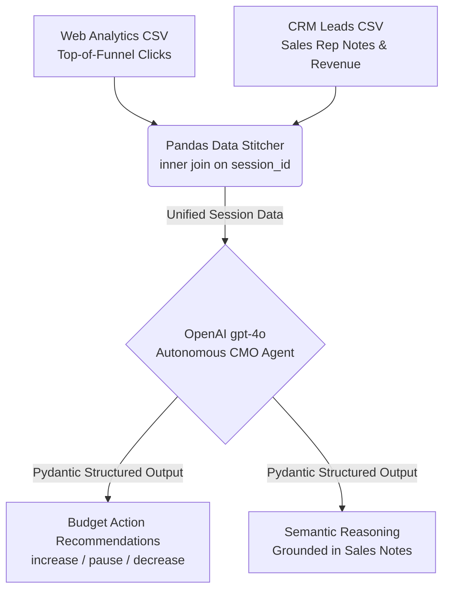
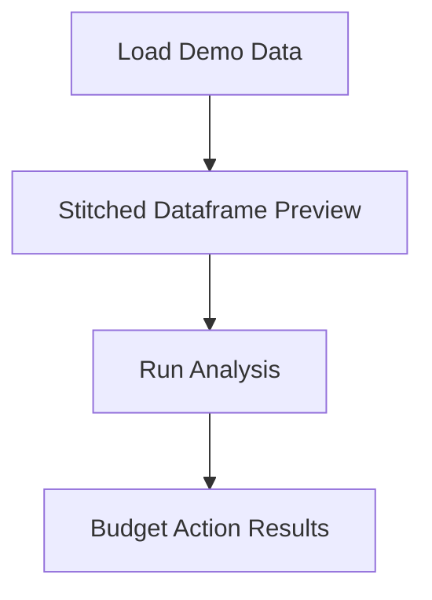

# Performance Plus — Design & User Flow Artifacts

Performance Plus is a GenAI-native performance marketing tool that stitches web analytics data with CRM sales notes and uses gpt-4o to translate qualitative lead sentiment into immediate, quantitative ad budget decisions. This document is a mid-sprint submission artifact for the OpenAI x Outskill hackathon — design only, no code.

## System Architecture



Two CSV files — a Web Analytics export and a CRM leads export — are ingested and merged on the shared `session_id` join key using a Pandas inner join, producing a single unified session-level dataframe. This enriched dataframe is passed in full to an OpenAI gpt-4o "Autonomous CMO" agent, which reasons over both quantitative click metrics and qualitative sales rep notes simultaneously. The agent returns a Pydantic Structured Output that is split into two channels: Budget Action Recommendations (campaign-level increase / pause / decrease directives with percentage changes) and Semantic Reasoning (natural-language justification grounded directly in what sales reps wrote about each lead).

## User Flow



The node labels above match the HTML mockup screen titles verbatim (per D-16 label consistency contract) — a reviewer can cross-reference this diagram against the files in `design/screens/` character-for-character. This diagram shows the happy path only; error states (bad CSV, zero-row merge, API failure) are out of scope for this design document.

## Screen Designs

The three HTML mockups below represent the Streamlit-style screens a user walks through. Each file is self-contained and can be opened in any browser without a running application.

- [`design/screens/01-load-demo.html`](../../design/screens/01-load-demo.html) — Streamlit-style mockup of the Load Demo Data screen (entry point with simulated file_uploader stubs and a primary "Load Demo Data" button).
- [`design/screens/02-dataframe-preview.html`](../../design/screens/02-dataframe-preview.html) — Streamlit-style mockup of the Stitched Dataframe Preview screen showing the 9-column merged dataframe (6 web analytics + 5 CRM minus 2 join keys) plus a primary "Run Analysis" button.
- [`design/screens/03-results.html`](../../design/screens/03-results.html) — Streamlit-style mockup of the Budget Action Results screen with a table of campaigns and color-coded badge pills (green INCREASE, red PAUSE, yellow DECREASE, grey INSUFFICIENT DATA) per D-03.

## Mock Data Schema — DSGN-04

### Web Analytics CSV

| Column | Type | Example | Notes |
|--------|------|---------|-------|
| `session_id` | string | `sess_001` | Join key — must match CRM |
| `campaign_id` | string | `cmp_b2b_search` | Groups sessions into campaigns |
| `clicks` | integer | `142` | Raw click count |
| `impressions` | integer | `4800` | Raw impression count |
| `cost_usd` | float | `87.50` | Spend for this session |
| `conversion_rate` | float | `0.031` | Decimal (e.g. 3.1%) |

### CRM Leads CSV

| Column | Type | Example | Notes |
|--------|------|---------|-------|
| `session_id` | string | `sess_001` | Join key — matches web analytics |
| `campaign_id` | string | `cmp_b2b_search` | Must match web analytics campaign_id |
| `lead_status` | string | `Disqualified` | Categorical: Qualified / Disqualified / Nurture |
| `projected_value` | float | `0.00` | Revenue potential in USD |
| `sales_notes` | string | `"Lead thought we were a consumer app..."` | Unstructured free text — AI primary signal |

### Join Key

The join key is `session_id`, using a Pandas inner join; `validate="m:1"` enforces one CRM row per session, preventing accidental fanout from duplicate session IDs.

```python
merged = pd.merge(
    web_analytics_df,
    crm_df,
    on="session_id",
    how="inner",
    validate="m:1"
)
```

### Sample Data

**Web Analytics CSV (sample):**

| session_id | campaign_id | clicks | impressions | cost_usd | conversion_rate |
|------------|-------------|--------|-------------|----------|-----------------|
| sess_001 | cmp_b2b_search | 142 | 4800 | 87.50 | 0.031 |
| sess_003 | cmp_b2b_search | 118 | 5100 | 92.00 | 0.028 |
| sess_005 | cmp_b2b_search | 156 | 5300 | 101.00 | 0.033 |
| sess_007 | cmp_b2b_search | 131 | 4600 | 84.00 | 0.029 |
| sess_009 | cmp_b2b_search | 109 | 4200 | 77.50 | 0.026 |
| sess_002 | cmp_competitor_conquest | 38 | 2100 | 42.00 | 0.078 |
| sess_004 | cmp_competitor_conquest | 44 | 1900 | 38.50 | 0.084 |
| sess_006 | cmp_competitor_conquest | 52 | 2400 | 48.00 | 0.091 |
| sess_008 | cmp_competitor_conquest | 29 | 1700 | 35.00 | 0.071 |
| sess_010 | cmp_retargeting | 87 | 3200 | 65.00 | 0.042 |
| sess_011 | cmp_retargeting | 74 | 2900 | 58.00 | 0.038 |
| sess_012 | cmp_retargeting | 93 | 3400 | 71.00 | 0.049 |
| sess_013 | cmp_retargeting | 61 | 2700 | 53.50 | 0.035 |
| sess_014 | cmp_linkedin_outbound | 45 | 3800 | 95.00 | 0.018 |
| sess_015 | cmp_linkedin_outbound | 38 | 3500 | 88.00 | 0.015 |
| sess_016 | cmp_linkedin_outbound | 51 | 4100 | 102.00 | 0.021 |
| sess_017 | cmp_brand_awareness | 210 | 7800 | 145.00 | 0.008 |
| sess_018 | cmp_brand_awareness | 187 | 7100 | 132.00 | 0.009 |
| sess_019 | cmp_b2b_search | 124 | 4900 | 89.00 | 0.030 |
| sess_020 | cmp_competitor_conquest | 41 | 1950 | 40.00 | 0.076 |

**CRM Leads CSV (sample):**

| session_id | campaign_id | lead_status | projected_value | sales_notes |
|------------|-------------|-------------|-----------------|-------------|
| sess_001 | cmp_b2b_search | Disqualified | 0.00 | Lead thought we were a consumer app. Angry when I mentioned enterprise pricing. Bad targeting. |
| sess_003 | cmp_b2b_search | Disqualified | 0.00 | Wrong segment, looking for SMB tooling, not enterprise. Not worth following up. |
| sess_005 | cmp_b2b_search | Disqualified | 0.00 | Asked about consumer features, not enterprise. Confused about our product category. |
| sess_007 | cmp_b2b_search | Disqualified | 0.00 | Budget too small, decision-maker not involved. Misaligned from the start. |
| sess_009 | cmp_b2b_search | Disqualified | 0.00 | Looking for a free tool, pushed back on pricing immediately. Not enterprise-grade buyer. |
| sess_002 | cmp_competitor_conquest | Qualified | 5000.00 | Perfect fit. Loved the ROI dashboard feature. Ready to sign next week. |
| sess_004 | cmp_competitor_conquest | Qualified | 8500.00 | Came from competitor X, ready to switch. Pricing aligned, contract review in progress. |
| sess_006 | cmp_competitor_conquest | Qualified | 6200.00 | Decision-maker on call, strong interest in attribution features. Deciding next month. |
| sess_008 | cmp_competitor_conquest | Qualified | 4800.00 | Previously using a legacy tool, impressed by our CRM integration demo. High buy intent. |
| sess_010 | cmp_retargeting | Nurture | 1200.00 | Still evaluating, revisited pricing page twice. Needs more time before committing. |
| sess_011 | cmp_retargeting | Disqualified | 0.00 | Revisited the site but ultimately went with a cheaper option. Not a fit at this price. |
| sess_012 | cmp_retargeting | Nurture | 2100.00 | Warm lead, opened 3 follow-up emails. Scheduled a second demo call for next week. |
| sess_013 | cmp_retargeting | Disqualified | 0.00 | Re-engaged briefly but team budget frozen until Q3. Unlikely to close this quarter. |
| sess_014 | cmp_linkedin_outbound | Nurture | 800.00 | Connected on LinkedIn, lukewarm interest. Has not responded to last two follow-ups. |
| sess_015 | cmp_linkedin_outbound | Nurture | 600.00 | Slow follow-up, initially interested but now unresponsive. May need a break in cadence. |
| sess_016 | cmp_linkedin_outbound | Nurture | 950.00 | Soft interest only, no clear use case articulated. Will revisit in 60 days. |
| sess_017 | cmp_brand_awareness | Nurture | 300.00 | Top-of-funnel only, no specific pain point surfaced yet. Early awareness stage. |
| sess_018 | cmp_brand_awareness | Disqualified | 0.00 | Clicked through from a broad awareness ad, not a decision-maker, no follow-up needed. |
| sess_019 | cmp_b2b_search | Disqualified | 0.00 | No enterprise need, mentioned they run a small agency. Completely out of our ICP. |
| sess_020 | cmp_competitor_conquest | Qualified | 5500.00 | Strong referral from an existing customer. Motivated to switch before Q3 budget cycle. |

The sample data is designed to create deliberate quantitative-vs-qualitative contradictions (D-07): `cmp_b2b_search` looks attractive on click volume and impression metrics but every sales rep note reveals deeply misaligned targeting — the AI correctly reads these signals as a PAUSE directive. Conversely, `cmp_competitor_conquest` shows lower absolute click counts but every CRM note reveals high-intent, qualified buyers ready to close — making it the obvious INCREASE candidate. This contradiction between surface-level click data and actual lead quality is the headline demo narrative for Performance Plus.
